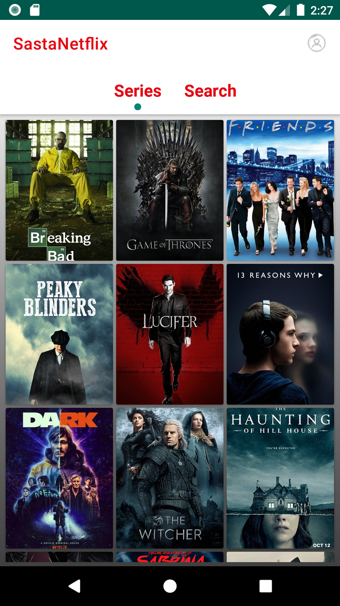
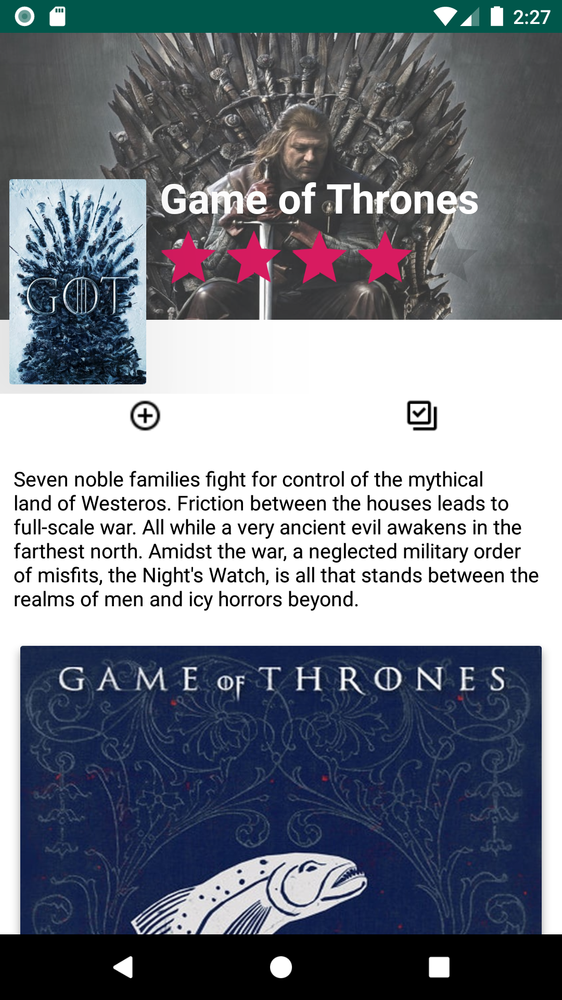

# SastaNetflix
[](LICENSE)


**Sasta Netlflix** is video Streaming Platform. Akin to Neflix/Prime I made an app that helps you stream content or the internet. Let's you login,stream stuff. For info about the TV series the app relies on TheMovieDB and fetches data from their api.Rest of the data is hosted on Firebase.. Dedicated to all Android Developers with ❤️.
## Built With 🛠

- [Kotlin](https://kotlinlang.org/) - First class and official programming language for Android development.
- [Coroutines](https://kotlinlang.org/docs/reference/coroutines-overview.html) - For asynchronous and more..
- [Android Architecture Components](https://developer.android.com/topic/libraries/architecture) - Collection of libraries that help you design robust, testable, and maintainable apps.
  - [LiveData](https://developer.android.com/topic/libraries/architecture/livedata) - Data objects that notify views when the underlying database changes.
  - [ViewModel](https://developer.android.com/topic/libraries/architecture/viewmodel) - Stores UI-related data that isn't destroyed on UI changes.
  - [ViewBinding](https://developer.android.com/topic/libraries/view-binding) - Generates a binding class for each XML layout file present in that module and allows you to more easily write code that interacts with views.
- [GiraffePlayer2](https://github.com/tcking/GiraffePlayer2) - Out of the box android video player（support lazy load, ListView/RecyclerView and hight performance）
- [Retrofit](https://square.github.io/retrofit/) - A type-safe HTTP client for Android and Java.
- [Firebase](https://firebase.google.com/) - A comprehensive app development platform.
- [Material Components for Android](https://github.com/material-components/material-components-android) - Modular and customizable Material Design UI components for Android.
- [Lottie](https://github.com/airbnb/lottie-android) - Render After Effects animations natively on Android and iOS, Web, and React Native
- [Timber](https://github.com/JakeWharton/timber) - This is a logger with a small, extensible API which provides utility on top of Android's normal Log clas
- [Shimmer](https://github.com/facebook/Shimmer) - An easy way to add a simple, shimmering effect to any view in an iOS app.

## Architecture

This app uses [**_MVVM (Model View View-Model)_**](https://developer.android.com/jetpack/docs/guide#recommended-app-arch) architecture.


# Screenshots





## Contribute

If you want to contribute to this library, you're always welcome!
See [Contributing Guidelines](CONTRIBUTING.md).

## Contact

If you need any help, you can connect with me.

Visit:- [Vedant Mamgain](https://www.linkedin.com/in/vedant-mamgain/)

## License

```
MIT License

Copyright (c) 2020 Vedant Mamgain

Permission is hereby granted, free of charge, to any person obtaining a copy
of this software and associated documentation files (the "Software"), to deal
in the Software without restriction, including without limitation the rights
to use, copy, modify, merge, publish, distribute, sublicense, and/or sell
copies of the Software, and to permit persons to whom the Software is
furnished to do so, subject to the following conditions:

The above copyright notice and this permission notice shall be included in all
copies or substantial portions of the Software.

THE SOFTWARE IS PROVIDED "AS IS", WITHOUT WARRANTY OF ANY KIND, EXPRESS OR
IMPLIED, INCLUDING BUT NOT LIMITED TO THE WARRANTIES OF MERCHANTABILITY,
FITNESS FOR A PARTICULAR PURPOSE AND NONINFRINGEMENT. IN NO EVENT SHALL THE
AUTHORS OR COPYRIGHT HOLDERS BE LIABLE FOR ANY CLAIM, DAMAGES OR OTHER
LIABILITY, WHETHER IN AN ACTION OF CONTRACT, TORT OR OTHERWISE, ARISING FROM,
OUT OF OR IN CONNECTION WITH THE SOFTWARE OR THE USE OR OTHER DEALINGS IN THE
SOFTWARE.
```
